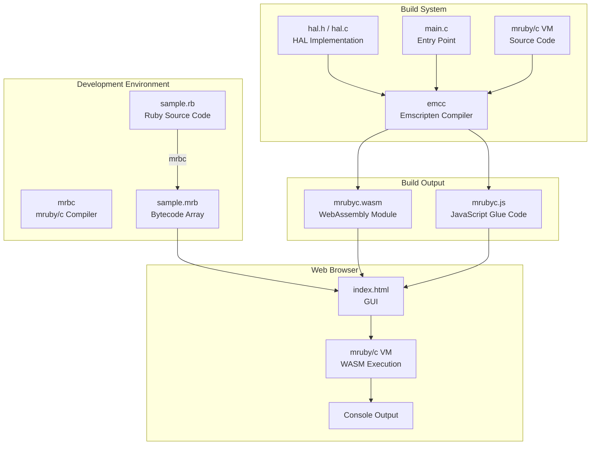
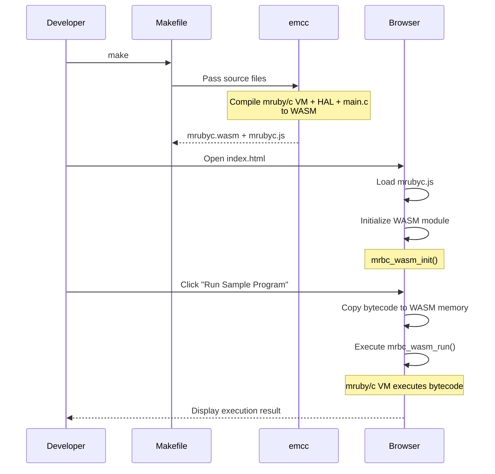
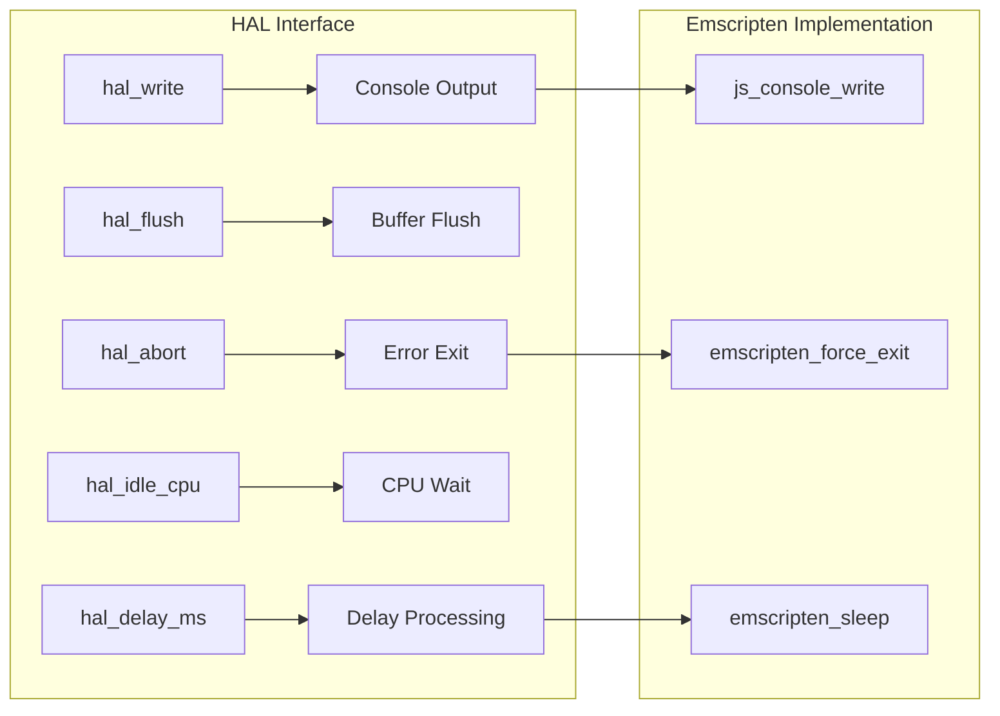
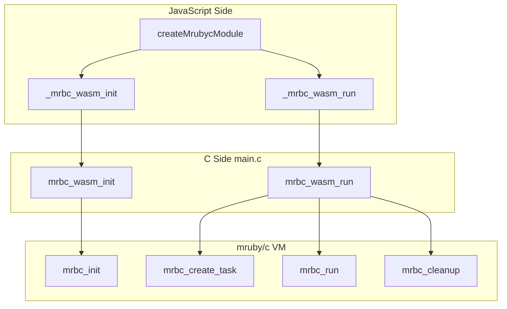
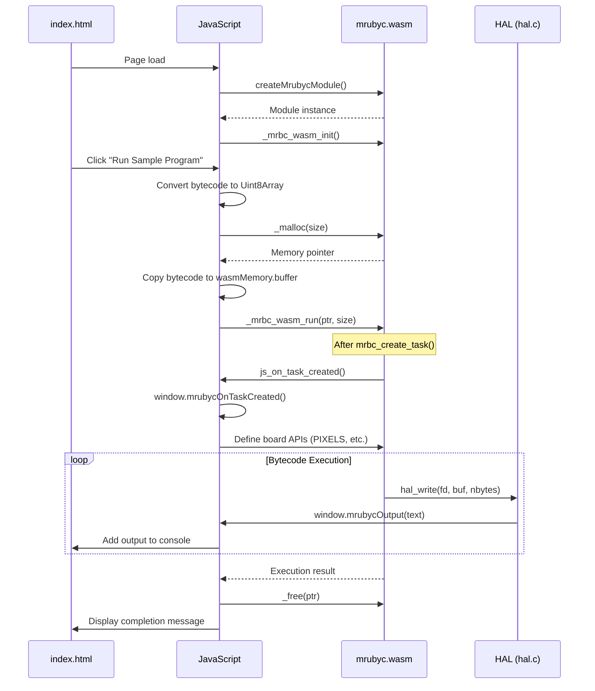
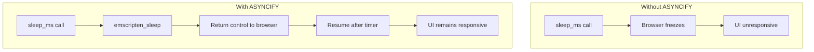

# study-WebSimulator

[](https://deepwiki.com/uist1idrju3i/study-WebSimulator)

A project that compiles mruby/c to WebAssembly using Emscripten and runs it in a web browser.

## Overview

This project compiles [mruby/c](https://github.com/mrubyc/mrubyc), an embedded Ruby implementation for microcontrollers, to WebAssembly (WASM) and provides an environment to execute mruby/c bytecode in a web browser.

## Architecture

### System Overview



### Build Flow



## Directory Structure

```
study-WebSimulator/
├── Makefile                    # Emscripten build configuration
├── README.md                   # This file
├── emsdk/                      # Emscripten SDK (submodule)
├── mrubyc/                     # mruby/c (submodule)
├── public_html/                # Web public directory
│   ├── index.html              # HTML markup
│   ├── style.css               # Stylesheet
│   ├── app.js                  # Application logic
│   ├── sample_bytecode.js      # Sample bytecode
│   ├── mrubyc/                 # mruby/c WASM files
│   │   ├── mrubyc.js           # Emscripten-generated JS glue code
│   │   ├── mrubyc.wasm         # WebAssembly module
│   │   └── LICENSE             # mruby/c license
│   ├── lib/
│   │   └── board-loader.js     # Board loader
│   └── boards/
│       └── xiao-nrf54l15/      # Board configuration
│           ├── board-config.js
│           ├── api-definitions.js
│           └── ui-components.js
└── src/
    ├── main.c                  # WASM entry point
    ├── lib/
    │   └── mrubyc/
    │       ├── hal.h           # HAL header
    │       └── hal.c           # HAL implementation
    └── rb/
        ├── sample.rb           # Sample Ruby code
        └── sample.mrb          # Compiled bytecode
```

## File Descriptions

### 1. Makefile

Build configuration for compiling mruby/c to WebAssembly using Emscripten.

**Key Settings:**

| Setting | Value | Description |
|---------|-------|-------------|
| `CFLAGS` | `-O3 -flto -DNDEBUG` | Optimization level 3, debug disabled |
| `WASM=1` | - | Enable WebAssembly output |
| `ASYNCIFY` | - | Support for async operations (sleep, etc.) |
| `ASYNCIFY_STACK_SIZE` | `16384` | ASYNCIFY stack size (increased from default 4096) |
| `ASYNCIFY_ADD` | `["mrbc_*","hal_*","main"]` | Function patterns for ASYNCIFY |
| `MODULARIZE=1` | - | Output as ES module |
| `ALLOW_MEMORY_GROWTH=1` | - | Allow dynamic memory expansion |

**Exported Functions:**
- `_mrbc_wasm_init`: VM initialization
- `_mrbc_wasm_run`: Bytecode execution
- `_malloc` / `_free`: Memory management
- Class/method definition and instance creation APIs (see WASM API Reference)

### 2. src/lib/mrubyc/hal.h (HAL Header)

Hardware Abstraction Layer header file. Abstracts hardware-dependent parts of mruby/c to enable operation on different platforms.

**Key Changes:**
- Uses `emscripten_sleep()` instead of `delay()` for the Emscripten environment
- Defines `MRBC_NO_TIMER` to disable timer interrupts (not needed in browser)
- Defines `MRBC_SCHEDULER_EXIT` to enable scheduler exit



### 3. src/lib/mrubyc/hal.c (HAL Implementation)

Concrete HAL implementation for the Emscripten environment.

**Implementation Details:**

| Function | Description | Implementation |
|----------|-------------|----------------|
| `hal_write()` | Write to stdout | Calls JavaScript function via `EM_JS` macro |
| `hal_flush()` | Flush buffer | No-op (immediate output) |
| `hal_abort()` | Abnormal termination | Display error message, then `emscripten_force_exit(1)` |
| `hal_delay_ms()` | Millisecond delay | Uses `emscripten_sleep()` |

**About the EM_JS Macro:**
The Emscripten `EM_JS` macro allows calling JavaScript functions directly from C. This enables access to browser console APIs and DOM manipulation.

```c
EM_JS(void, js_console_write, (const char *buf, int nbytes), {
  const text = UTF8ToString(buf, nbytes);
  if (typeof window !== 'undefined' && window.mrubycOutput) {
    window.mrubycOutput(text);  // Custom output function
  } else {
    console.log(text);          // Fallback
  }
});
```

### 4. src/main.c (Entry Point)

WebAssembly module entry point. Defines functions called from JavaScript.

**Export Functions:**



**Memory Management:**
- Allocates a 40KB static memory pool
- mruby/c memory allocator manages memory within this pool
- Resources are released with `mrbc_cleanup()` after execution and reinitialized

**Task Callback Mechanism:**
After bytecode is loaded with `mrbc_create_task()` but before execution with `mrbc_run()`, a JavaScript callback (`window.mrubycOnTaskCreated`) is invoked. This ensures that board APIs (like PIXELS) are defined with symbol IDs that match those in the bytecode.

### 5. public_html/index.html (HTML Markup)

HTML markup for the user interface to operate mruby/c in the browser. Styles and logic are separated into separate files (style.css, app.js).

**Features:**
1. **Status Display**: Module loading state and version information
2. **Sample Execution**: Run built-in sample program
3. **Custom Bytecode**: Upload and execute `.mrb` files
4. **Output Console**: Real-time display of execution results

### 6. public_html/style.css (Stylesheet)

CSS file containing GUI style definitions. Supports responsive design and implements dark-themed console display.

### 7. public_html/app.js (Application Logic)

JavaScript file containing application logic for WASM module initialization, bytecode execution, file upload handling, etc.

**Key Features:**
- Async initialization of WASM module
- Bytecode memory copy and execution (`ccall` with `async: true` option for ASYNCIFY support)
- File size validation (1MB limit)
- Error handling and memory release
- Task creation callback (`mrubycOnTaskCreated`) for board API definition

**JavaScript-WASM Integration:**



### 8. public_html/sample_bytecode.js

JavaScript file defining the bytecode from `src/rb/sample.mrb` as a JavaScript array.

**Original Ruby Code (sample.rb):**
The sample program displays a rainbow circle animation on a 6x10 RGB LED matrix using HSV to RGB color conversion. It uses `PIXELS.set(index, r, g, b)` to set individual LED colors and `PIXELS.update()` to refresh the display.

```ruby
puts ("Hello Ruby")
# ... LED matrix animation using PIXELS.set() and PIXELS.update() ...
```

## Build Instructions

### Prerequisites

- Git (for submodule retrieval)
- Python 3 (for Emscripten SDK)

### Steps

1. **Clone the Repository**
   ```bash
   git clone --recursive https://github.com/uist1idrju3i/study-WebSimulator.git
   cd study-WebSimulator
   ```

2. **Set Up Emscripten SDK**
   ```bash
   cd emsdk
   ./emsdk install latest
   ./emsdk activate latest
   source ./emsdk_env.sh
   cd ..
   ```

3. **Build**
   ```bash
   make
   ```

4. **Run Local Server**
   ```bash
   cd public_html
   python3 -m http.server 8080
   ```

5. **Access in Browser**
   ```
   http://localhost:8080/
   ```

## Technical Details

### About ASYNCIFY

Emscripten's `ASYNCIFY` feature allows synchronous C functions to execute asynchronously. This enables wait functions like `sleep_ms()` to work without blocking the browser's event loop.



### Memory Management

WebAssembly memory is managed as linear memory. To access WASM memory from JavaScript, use `wasmMemory.buffer`.

```javascript
const bytecodePtr = mrubycModule._malloc(bytecode.length);
const heapU8 = new Uint8Array(mrubycModule.wasmMemory.buffer);
heapU8.set(bytecode, bytecodePtr);
```

## Creating Board Configurations

This project allows adding support for new microcontroller boards through JavaScript alone, without recompiling C code.

### Directory Structure

To add a new board, create files in the `public_html/boards/` directory with the following structure:

```
public_html/boards/
└── your-board-id/
    ├── board-config.js      # Board-specific configuration
    ├── ui-components.js     # UI generation code
    └── api-definitions.js   # mruby/c API definitions
```

### Required Files

#### 1. board-config.js

Defines basic board settings:

```javascript
const BOARD_CONFIG = {
  name: "Your Board Name",
  id: "your-board-id",
  description: "Description of your board",
  
  ui: {
    matrixWidth: 10,    // LED matrix width
    matrixHeight: 6,    // LED matrix height
    totalPixels: 60     // Total LED count
  }
};

if (typeof window !== 'undefined') {
  window.BOARD_CONFIG = BOARD_CONFIG;
}
```

#### 2. api-definitions.js

Defines classes and methods for mruby/c. Uses the `MrubycWasmAPI` class to access WASM APIs:

```javascript
let registeredCallbacks = [];

class MrubycWasmAPI {
  constructor(module) {
    this.module = module;
  }

  // Class definition
  getClassObject() {
    return this.module._mrbc_wasm_get_class_object();
  }

  defineClass(name, superClass) {
    return this.module.ccall(
      'mrbc_wasm_define_class', 'number',
      ['string', 'number'], [name, superClass]
    );
  }

  defineMethod(cls, name, func) {
    this.module.ccall(
      'mrbc_wasm_define_method', null,
      ['number', 'string', 'number'], [cls, name, func]
    );
  }

  // Argument retrieval methods
  getIntArg(vPtr, index) {
    return this.module._mrbc_wasm_get_int_arg(vPtr, index);
  }

  getFloatArg(vPtr, index) {
    return this.module._mrbc_wasm_get_float_arg(vPtr, index);
  }

  isNumericArg(vPtr, index) {
    return this.module._mrbc_wasm_is_numeric_arg(vPtr, index) !== 0;
  }

  // Return value setting methods
  setReturnBool(vPtr, val) {
    this.module._mrbc_wasm_set_return_bool(vPtr, val ? 1 : 0);
  }

  setReturnNil(vPtr) {
    this.module._mrbc_wasm_set_return_nil(vPtr);
  }

  setReturnInt(vPtr, val) {
    this.module._mrbc_wasm_set_return_int(vPtr, val);
  }

  setReturnFloat(vPtr, val) {
    this.module._mrbc_wasm_set_return_float(vPtr, val);
  }

  // Instance creation and global constants
  instanceNew(cls) {
    return this.module._mrbc_wasm_instance_new(cls);
  }

  setGlobalConst(name, value) {
    this.module.ccall(
      'mrbc_wasm_set_global_const', null,
      ['string', 'number'], [name, value]
    );
  }

  freeInstance(instance) {
    this.module._mrbc_wasm_free_instance(instance);
  }

  // Callback function registration
  addFunction(func, signature) {
    return this.module.addFunction(func, signature);
  }

  removeFunction(funcPtr) {
    this.module.removeFunction(funcPtr);
  }
}

function defineYourAPI(mrubycModule) {
  const api = new MrubycWasmAPI(mrubycModule);
  const classObject = api.getClassObject();
  
  // Define class
  const yourClass = api.defineClass('YourClass', classObject);
  
  // Define method
  // Signature: void func(mrb_vm *vm, mrb_value *v, int argc)
  const methodCallback = api.addFunction((vmPtr, vPtr, argc) => {
    // Get arguments
    if (api.isNumericArg(vPtr, 1)) {
      const arg1 = api.getIntArg(vPtr, 1);
      // Processing...
      api.setReturnBool(vPtr, true);
    } else {
      api.setReturnBool(vPtr, false);
    }
  }, 'viii');
  
  registeredCallbacks.push(methodCallback);
  api.defineMethod(yourClass, 'method_name', methodCallback);
  
  // Create instance and set as global constant
  const instance = api.instanceNew(yourClass);
  if (instance) {
    api.setGlobalConst('YOUR_CONSTANT', instance);
  }
}

function cleanupYourAPI(mrubycModule) {
  const api = new MrubycWasmAPI(mrubycModule);
  for (const callback of registeredCallbacks) {
    try {
      api.removeFunction(callback);
    } catch (e) {
      // Ignore cleanup errors
    }
  }
  registeredCallbacks = [];
}

if (typeof window !== 'undefined') {
  window.defineYourAPI = defineYourAPI;
  window.cleanupYourAPI = cleanupYourAPI;
}
```

#### 3. ui-components.js

Generates board-specific UI elements:

```javascript
function createBoardUI(container, config) {
  container.innerHTML = '';
  
  const title = document.createElement('div');
  title.textContent = `${config.ui.matrixWidth}x${config.ui.matrixHeight} RGB MATRIX for ${config.name}`;
  container.appendChild(title);
  
  const dotContainer = document.createElement('div');
  dotContainer.id = 'dot-container';
  container.appendChild(dotContainer);
  
  for (let i = 0; i < config.ui.totalPixels; i++) {
    const dot = document.createElement('div');
    dot.id = i;
    dot.className = 'dot';
    dot.textContent = i;
    dotContainer.appendChild(dot);
  }
}

function setPixelColor(id, red, green, blue) {
  const targetDot = document.getElementById(id);
  if (targetDot) {
    targetDot.style.backgroundColor = `rgb(${red}, ${green}, ${blue})`;
    const brightness = red + green + blue;
    targetDot.style.color = brightness > 128 * 3 ? '#666' : 'white';
  }
}

function cleanupBoardUI(container) {
  container.innerHTML = '';
}

if (typeof window !== 'undefined') {
  window.createBoardUI = createBoardUI;
  window.setPixelColor = setPixelColor;
  window.cleanupBoardUI = cleanupBoardUI;
}
```

### Registering a New Board

Add the new board to the `availableBoards` array in `public_html/lib/board-loader.js`:

```javascript
this.availableBoards = [
  { id: 'xiao-nrf54l15', name: 'XIAO nRF54L15', path: 'boards/xiao-nrf54l15' },
  { id: 'your-board-id', name: 'Your Board Name', path: 'boards/your-board-id' }
];
```

Or register dynamically at runtime:

```javascript
boardLoader.registerBoard({
  id: 'your-board-id',
  name: 'Your Board Name',
  path: 'boards/your-board-id'
});
```

### WASM API Reference

| C Function | JavaScript API | Description |
|------------|----------------|-------------|
| `mrbc_wasm_get_class_object()` | `api.getClassObject()` | Get Object class pointer |
| `mrbc_wasm_define_class()` | `api.defineClass(name, super)` | Define a new class |
| `mrbc_wasm_define_method()` | `api.defineMethod(cls, name, func)` | Define a method |
| `mrbc_wasm_get_int_arg()` | `api.getIntArg(vPtr, index)` | Get integer argument |
| `mrbc_wasm_get_float_arg()` | `api.getFloatArg(vPtr, index)` | Get float argument |
| `mrbc_wasm_is_numeric_arg()` | `api.isNumericArg(vPtr, index)` | Check if argument is numeric |
| `mrbc_wasm_set_return_bool()` | `api.setReturnBool(vPtr, val)` | Return boolean value |
| `mrbc_wasm_set_return_nil()` | `api.setReturnNil(vPtr)` | Return nil |
| `mrbc_wasm_set_return_int()` | `api.setReturnInt(vPtr, val)` | Return integer value |
| `mrbc_wasm_set_return_float()` | `api.setReturnFloat(vPtr, val)` | Return float value |
| `mrbc_wasm_instance_new()` | `api.instanceNew(cls)` | Create new class instance |
| `mrbc_wasm_set_global_const()` | `api.setGlobalConst(name, value)` | Set global constant |
| `mrbc_wasm_free_instance()` | `api.freeInstance(instance)` | Free instance memory |

### Debugging

1. Open browser developer tools (F12)
2. Check error messages in the Console tab
3. Use `console.log()` to output debug information
4. Check script loading in the Network tab

### Important Notes

1. **Memory Management**: Callback functions created with `addFunction()` must be properly released with `removeFunction()` when switching boards.

2. **Error Handling**: Calls between JavaScript and WASM are not type-safe, so implement proper validation and error handling.

3. **Callback Signature**: mruby/c method callback functions use the `'viii'` signature (void, int, int, int).

4. **Symbol ID Matching**: Board APIs must be defined after bytecode is loaded (via `mrubycOnTaskCreated` callback) to ensure symbol IDs match between method definitions and bytecode.

## License

This project is distributed under the BSD 3-Clause License.

mruby/c is copyrighted by:
- Copyright (C) 2015- Kyushu Institute of Technology.
- Copyright (C) 2015- Shimane IT Open-Innovation Center.

## References

- [mruby/c](https://github.com/mrubyc/mrubyc) - Embedded Ruby implementation
- [Emscripten](https://emscripten.org/) - C/C++ to WebAssembly compiler
- [WebAssembly](https://webassembly.org/) - Binary format for browsers
