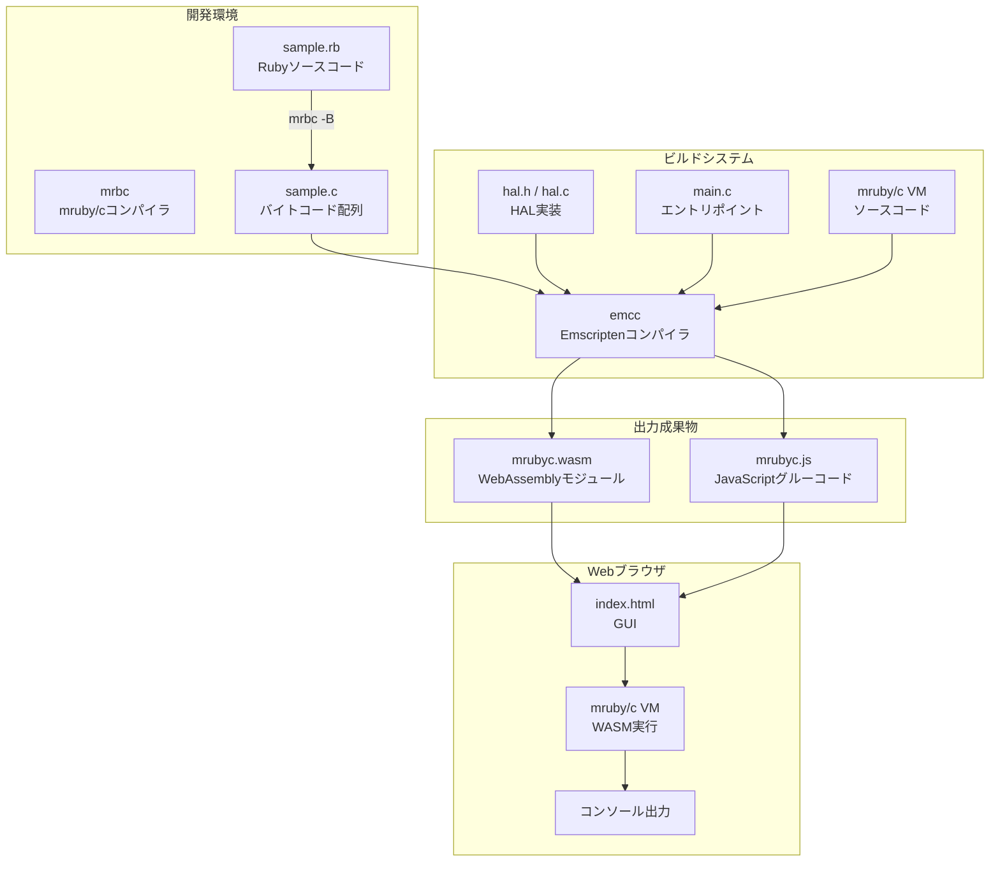
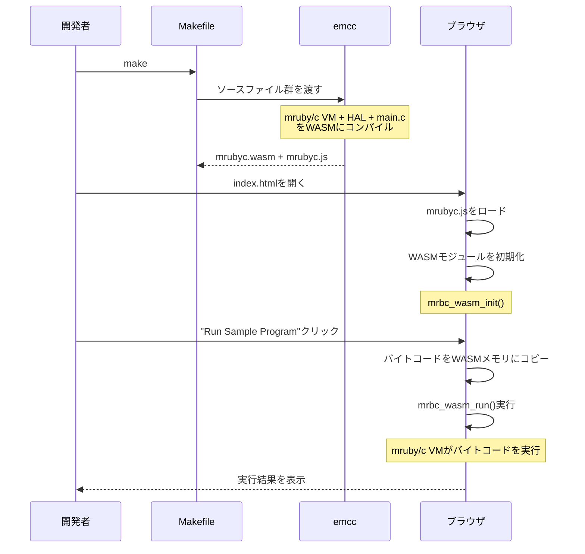
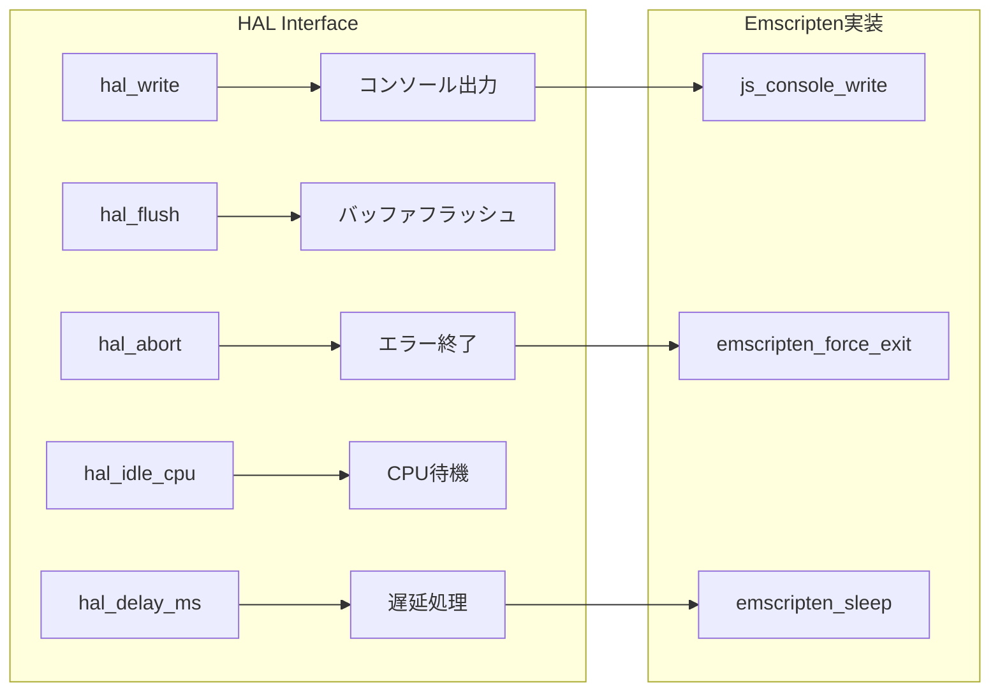
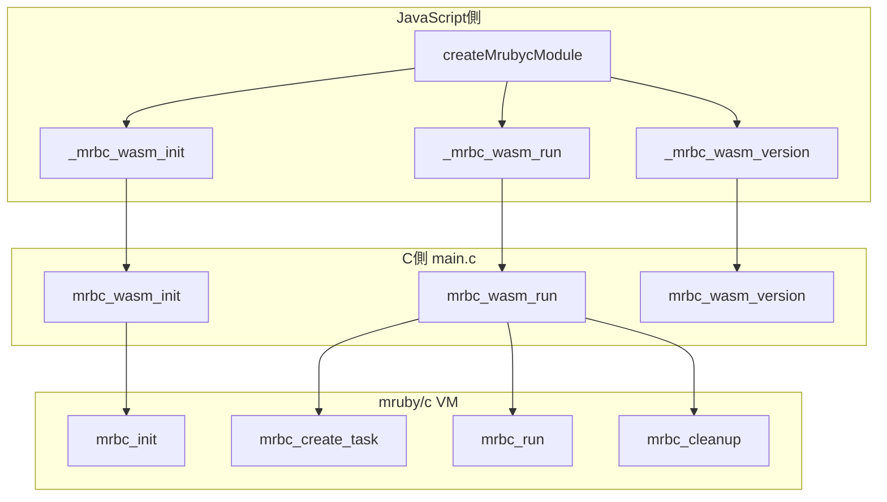
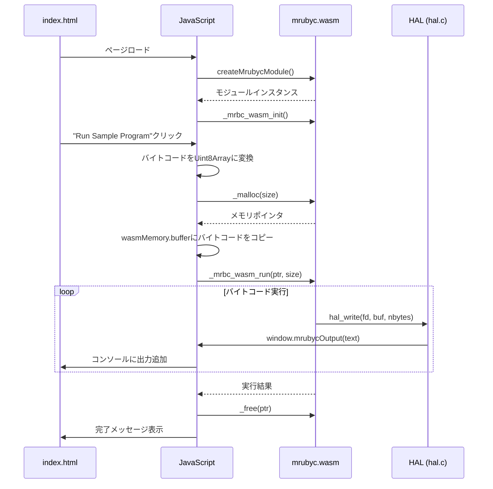

# study-WebSimulator

mruby/cをEmscriptenでWebAssemblyにビルドし、Webブラウザ上で動作させるプロジェクトです。

## 概要

このプロジェクトは、組み込み向けRuby実装である[mruby/c](https://github.com/mrubyc/mrubyc)をWebAssembly(WASM)にコンパイルし、Webブラウザ上でmruby/cバイトコードを実行できる環境を提供します。

## アーキテクチャ

### 全体構成



### ビルドフロー



## ディレクトリ構成

```
study-WebSimulator/
├── Makefile                    # Emscriptenビルド設定
├── README.md                   # このファイル
├── emsdk/                      # Emscripten SDK (サブモジュール)
├── mrubyc/                     # mruby/c (サブモジュール)
├── public_html/                # Web公開ディレクトリ
│   ├── index.html              # GUI
│   ├── mrubyc.js               # Emscripten生成JSグルーコード
│   ├── mrubyc.wasm             # WebAssemblyモジュール
│   └── sample_bytecode.js      # サンプルバイトコード
└── src/
    ├── main.c                  # WASMエントリポイント
    ├── lib/
    │   └── mrubyc/
    │       ├── hal.h           # HALヘッダー
    │       └── hal.c           # HAL実装
    └── rb/
        ├── sample.rb           # サンプルRubyコード
        └── sample.c            # コンパイル済みバイトコード
```

## 作成・変更したファイルの解説

### 1. Makefile

Emscriptenを使用してmruby/cをWebAssemblyにビルドするための設定ファイルです。

**主要な設定:**

| 設定項目 | 値 | 説明 |
|---------|-----|------|
| `CFLAGS` | `-O2 -DNDEBUG` | 最適化レベル2、デバッグ無効 |
| `WASM=1` | - | WebAssembly出力を有効化 |
| `ASYNCIFY` | - | 非同期処理（sleep等）のサポート |
| `MODULARIZE=1` | - | ESモジュール形式で出力 |
| `ALLOW_MEMORY_GROWTH=1` | - | 動的メモリ拡張を許可 |

**エクスポートされる関数:**
- `_mrbc_wasm_init`: VM初期化
- `_mrbc_wasm_run`: バイトコード実行
- `_mrbc_wasm_version`: バージョン取得
- `_malloc` / `_free`: メモリ管理

### 2. src/lib/mrubyc/hal.h (HALヘッダー)

Hardware Abstraction Layer（ハードウェア抽象化レイヤー）のヘッダーファイルです。mruby/cがハードウェアに依存する部分を抽象化し、異なるプラットフォームで動作できるようにします。

**変更理由:**
- 元のファイルは`delay()`関数を使用していましたが、Emscripten環境では`emscripten_sleep()`を使用する必要があります
- `MRBC_NO_TIMER`を定義してタイマー割り込みを無効化（ブラウザ環境では不要）
- `MRBC_SCHEDULER_EXIT`を定義してスケジューラ終了を有効化



### 3. src/lib/mrubyc/hal.c (HAL実装)

HALの具体的な実装ファイルです。Emscripten環境向けに以下の機能を実装しています。

**実装内容:**

| 関数 | 説明 | 実装方法 |
|------|------|----------|
| `hal_write()` | 標準出力への書き込み | `EM_JS`マクロでJavaScript関数を呼び出し |
| `hal_flush()` | バッファのフラッシュ | 何もしない（即時出力のため） |
| `hal_abort()` | 異常終了 | エラーメッセージ表示後、`emscripten_force_exit(1)` |
| `hal_delay_ms()` | ミリ秒単位の遅延 | `emscripten_sleep()`を使用 |

**EM_JSマクロについて:**
Emscriptenの`EM_JS`マクロを使用することで、C言語からJavaScript関数を直接呼び出すことができます。これにより、ブラウザのコンソールAPIやDOM操作が可能になります。

```c
EM_JS(void, js_console_write, (const char *buf, int nbytes), {
  const text = UTF8ToString(buf, nbytes);
  if (typeof window !== 'undefined' && window.mrubycOutput) {
    window.mrubycOutput(text);  // カスタム出力関数
  } else {
    console.log(text);          // フォールバック
  }
});
```

### 4. src/main.c (エントリポイント)

WebAssemblyモジュールのエントリポイントです。JavaScriptから呼び出される関数を定義しています。

**エクスポート関数:**



**メモリ管理:**
- 40KBの静的メモリプールを確保
- mruby/cのメモリアロケータがこのプール内でメモリを管理
- 実行後は`mrbc_cleanup()`でリソースを解放し、再初期化

### 5. public_html/index.html (GUI)

ブラウザ上でmruby/cを操作するためのユーザーインターフェースです。

**機能:**
1. **ステータス表示**: モジュールの読み込み状態とバージョン情報
2. **サンプル実行**: 組み込みのサンプルプログラムを実行
3. **カスタムバイトコード**: `.mrb`ファイルをアップロードして実行
4. **出力コンソール**: 実行結果をリアルタイム表示

**JavaScript-WASM連携:**



### 6. public_html/sample_bytecode.js

`src/rb/sample.c`のバイトコードをJavaScript配列として定義したファイルです。

**元のRubyコード (sample.rb):**
```ruby
printf "#{RUBY_ENGINE} #{MRUBYC_VERSION} (mruby:#{MRUBY_VERSION} ruby:#{RUBY_VERSION})\n"
printf "Hello, mruby/c!"
sleep_ms 1000
printf "Goodbye!"
```

## ビルド方法

### 前提条件

- Git（サブモジュール取得用）
- Python 3（Emscripten SDK用）

### 手順

1. **リポジトリのクローン**
   ```bash
   git clone --recursive https://github.com/uist1idrju3i/study-WebSimulator.git
   cd study-WebSimulator
   ```

2. **Emscripten SDKのセットアップ**
   ```bash
   cd emsdk
   ./emsdk install latest
   ./emsdk activate latest
   source ./emsdk_env.sh
   cd ..
   ```

3. **ビルド**
   ```bash
   make
   ```

4. **ローカルサーバーで実行**
   ```bash
   cd public_html
   python3 -m http.server 8080
   ```

5. **ブラウザでアクセス**
   ```
   http://localhost:8080/
   ```

## 技術的な詳細

### ASYNCIFYについて

Emscriptenの`ASYNCIFY`機能は、同期的なC関数を非同期的に実行できるようにします。これにより、`sleep_ms()`のような待機関数がブラウザのイベントループをブロックせずに動作します。


### メモリ管理

WebAssemblyのメモリは線形メモリとして管理されます。JavaScriptからWASMメモリにアクセスするには、`wasmMemory.buffer`を使用します。

```javascript
const bytecodePtr = mrubycModule._malloc(bytecode.length);
const heapU8 = new Uint8Array(mrubycModule.wasmMemory.buffer);
heapU8.set(bytecode, bytecodePtr);
```

## ライセンス

このプロジェクトはBSD 3-Clause Licenseの下で配布されています。

mruby/cは以下の著作権者によるものです：
- Copyright (C) 2015- Kyushu Institute of Technology.
- Copyright (C) 2015- Shimane IT Open-Innovation Center.

## 参考リンク

- [mruby/c](https://github.com/mrubyc/mrubyc) - 組み込み向けRuby実装
- [Emscripten](https://emscripten.org/) - C/C++からWebAssemblyへのコンパイラ
- [WebAssembly](https://webassembly.org/) - ブラウザで動作するバイナリ形式
