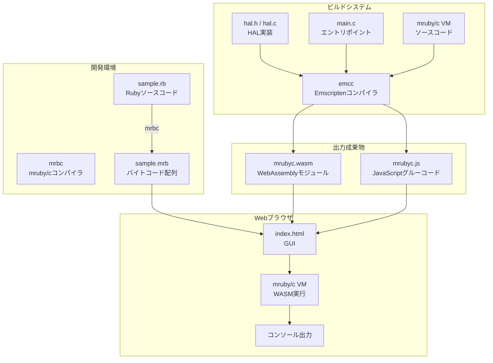
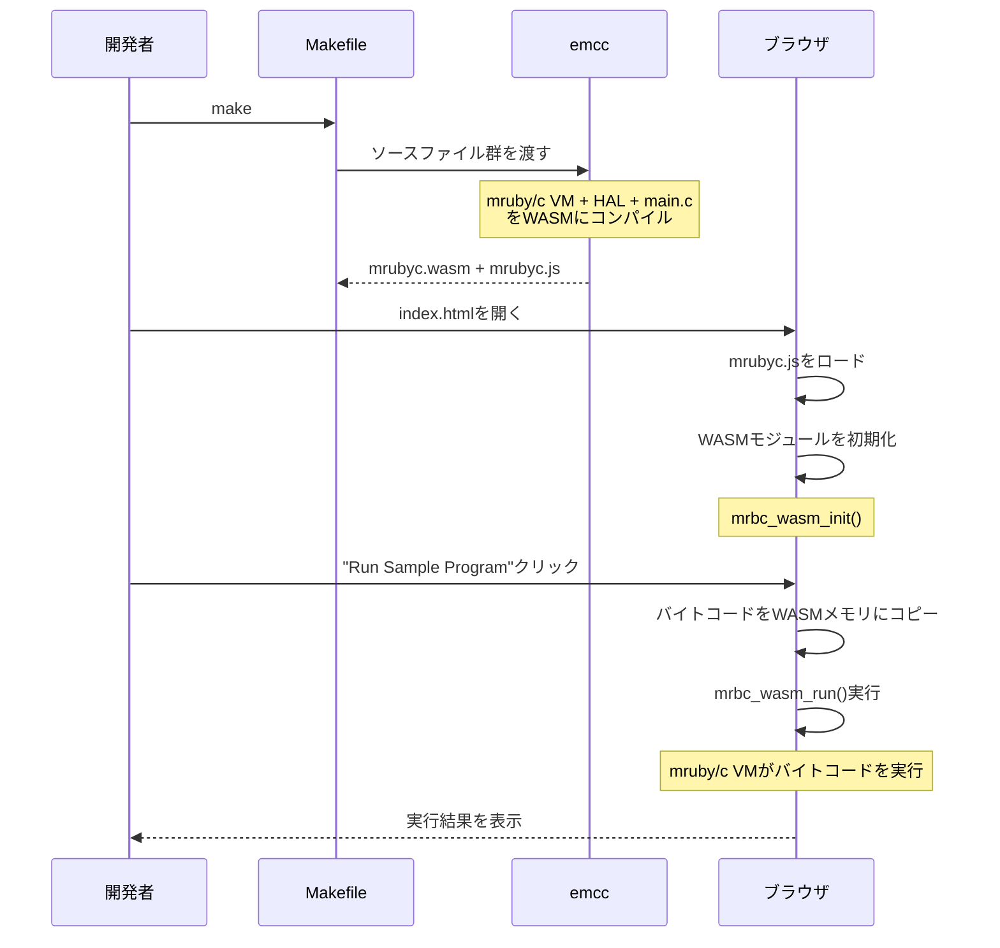
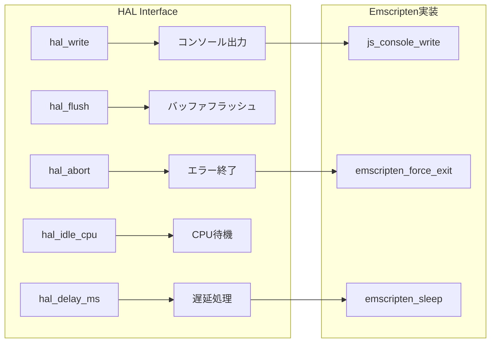
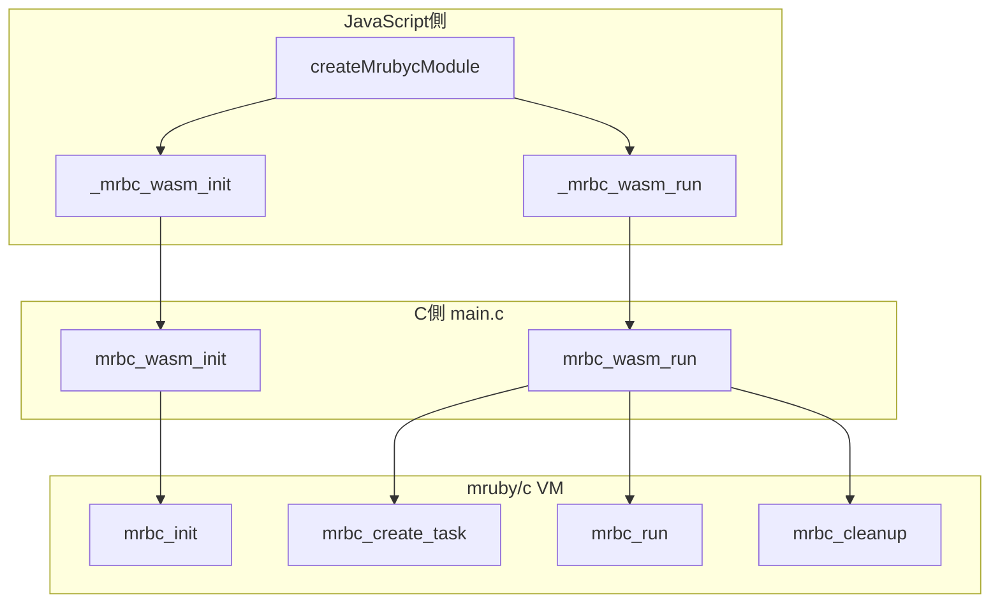
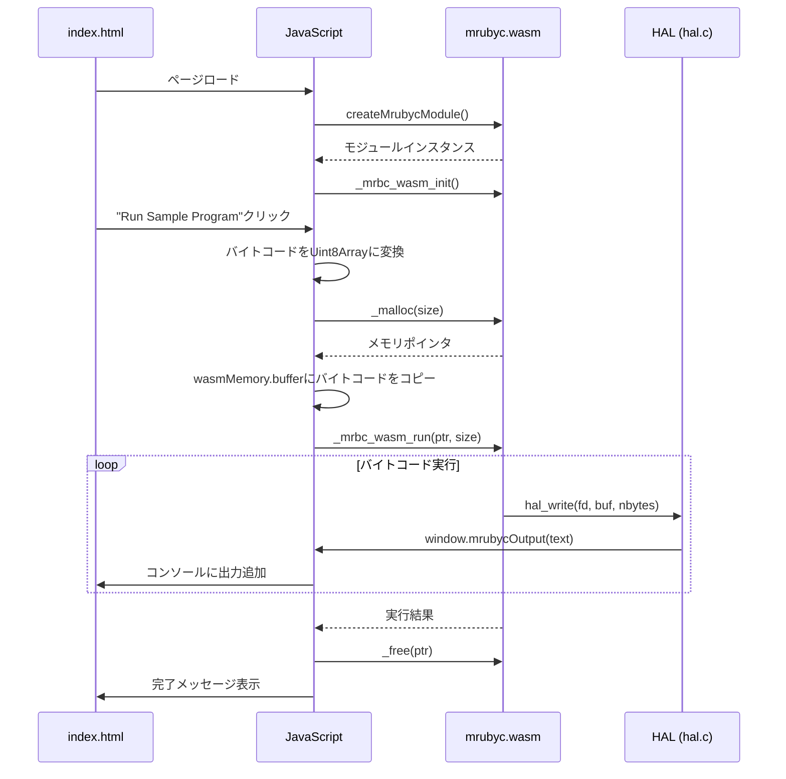

# study-WebSimulator

[](https://deepwiki.com/uist1idrju3i/study-WebSimulator)

mruby/cをEmscriptenでWebAssemblyにビルドし、Webブラウザ上で動作させるプロジェクトです。

## 概要

このプロジェクトは、組み込み向けRuby実装である[mruby/c](https://github.com/mrubyc/mrubyc)をWebAssembly(WASM)にコンパイルし、Webブラウザ上でmruby/cバイトコードを実行できる環境を提供します。

## アーキテクチャ

### 全体構成



### ビルドフロー



## ディレクトリ構成

```
study-WebSimulator/
├── Makefile                    # Emscriptenビルド設定
├── README.md                   # このファイル
├── emsdk/                      # Emscripten SDK (サブモジュール)
├── mrubyc/                     # mruby/c (サブモジュール)
├── public_html/                # Web公開ディレクトリ
│   ├── index.html              # HTMLマークアップ
│   ├── style.css               # スタイルシート
│   ├── app.js                  # アプリケーションロジック
│   ├── sample_bytecode.js      # サンプルバイトコード
│   └── mrubyc/                 # mruby/c WASM関連ファイル
│       ├── mrubyc.js           # Emscripten生成JSグルーコード
│       ├── mrubyc.wasm         # WebAssemblyモジュール
│       └── LICENSE             # mruby/cライセンス
└── src/
    ├── main.c                  # WASMエントリポイント
    ├── lib/
    │   └── mrubyc/
    │       ├── hal.h           # HALヘッダー
    │       └── hal.c           # HAL実装
    └── rb/
        ├── sample.rb           # サンプルRubyコード
        └── sample.mrb          # コンパイル済みバイトコード
```

## 作成・変更したファイルの解説

### 1. Makefile

Emscriptenを使用してmruby/cをWebAssemblyにビルドするための設定ファイルです。

**主要な設定:**

| 設定項目 | 値 | 説明 |
|---------|-----|------|
| `CFLAGS` | `-O3 -flto -DNDEBUG` | 最適化レベル3、デバッグ無効 |
| `WASM=1` | - | WebAssembly出力を有効化 |
| `ASYNCIFY` | - | 非同期処理（sleep等）のサポート |
| `ASYNCIFY_STACK_SIZE` | `16384` | ASYNCIFY用スタックサイズ（デフォルト4096から増加） |
| `ASYNCIFY_ADD` | `["mrbc_*","hal_*","main"]` | ASYNCIFY対象関数のパターン |
| `MODULARIZE=1` | - | ESモジュール形式で出力 |
| `ALLOW_MEMORY_GROWTH=1` | - | 動的メモリ拡張を許可 |

**エクスポートされる関数:**
- `_mrbc_wasm_init`: VM初期化
- `_mrbc_wasm_run`: バイトコード実行
- `_malloc` / `_free`: メモリ管理

### 2. src/lib/mrubyc/hal.h (HALヘッダー)

Hardware Abstraction Layer（ハードウェア抽象化レイヤー）のヘッダーファイルです。mruby/cがハードウェアに依存する部分を抽象化し、異なるプラットフォームで動作できるようにします。

**変更理由:**
- 元のファイルは`delay()`関数を使用していましたが、Emscripten環境では`emscripten_sleep()`を使用する必要があります
- `MRBC_NO_TIMER`を定義してタイマー割り込みを無効化（ブラウザ環境では不要）
- `MRBC_SCHEDULER_EXIT`を定義してスケジューラ終了を有効化



### 3. src/lib/mrubyc/hal.c (HAL実装)

HALの具体的な実装ファイルです。Emscripten環境向けに以下の機能を実装しています。

**実装内容:**

| 関数 | 説明 | 実装方法 |
|------|------|----------|
| `hal_write()` | 標準出力への書き込み | `EM_JS`マクロでJavaScript関数を呼び出し |
| `hal_flush()` | バッファのフラッシュ | 何もしない（即時出力のため） |
| `hal_abort()` | 異常終了 | エラーメッセージ表示後、`emscripten_force_exit(1)` |
| `hal_delay_ms()` | ミリ秒単位の遅延 | `emscripten_sleep()`を使用 |

**EM_JSマクロについて:**
Emscriptenの`EM_JS`マクロを使用することで、C言語からJavaScript関数を直接呼び出すことができます。これにより、ブラウザのコンソールAPIやDOM操作が可能になります。

```c
EM_JS(void, js_console_write, (const char *buf, int nbytes), {
  const text = UTF8ToString(buf, nbytes);
  if (typeof window !== 'undefined' && window.mrubycOutput) {
    window.mrubycOutput(text);  // カスタム出力関数
  } else {
    console.log(text);          // フォールバック
  }
});
```

### 4. src/main.c (エントリポイント)

WebAssemblyモジュールのエントリポイントです。JavaScriptから呼び出される関数を定義しています。

**エクスポート関数:**



**メモリ管理:**
- 40KBの静的メモリプールを確保
- mruby/cのメモリアロケータがこのプール内でメモリを管理
- 実行後は`mrbc_cleanup()`でリソースを解放し、再初期化

### 5. public_html/index.html (HTMLマークアップ)

ブラウザ上でmruby/cを操作するためのユーザーインターフェースのHTMLマークアップです。スタイルとロジックは別ファイル（style.css, app.js）に分離されています。

**機能:**
1. **ステータス表示**: モジュールの読み込み状態とバージョン情報
2. **サンプル実行**: 組み込みのサンプルプログラムを実行
3. **カスタムバイトコード**: `.mrb`ファイルをアップロードして実行
4. **出力コンソール**: 実行結果をリアルタイム表示

### 6. public_html/style.css (スタイルシート)

GUIのスタイル定義を含むCSSファイルです。レスポンシブデザインに対応し、ダークテーマのコンソール表示を実装しています。

### 7. public_html/app.js (アプリケーションロジック)

WASMモジュールの初期化、バイトコード実行、ファイルアップロード処理などのアプリケーションロジックを含むJavaScriptファイルです。

**主要な機能:**
- WASMモジュールの非同期初期化
- バイトコードのメモリコピーと実行（`ccall`の`async: true`オプションでASYNCIFYに対応）
- ファイルサイズ検証（1MB制限）
- エラーハンドリングとメモリ解放

**JavaScript-WASM連携:**



### 8. public_html/sample_bytecode.js

`src/rb/sample.mrb`のバイトコードをJavaScript配列として定義したファイルです。

**元のRubyコード (sample.rb):**
```ruby
printf "#{RUBY_ENGINE} #{MRUBYC_VERSION} (mruby:#{MRUBY_VERSION} ruby:#{RUBY_VERSION})\n"
puts "Hello, mruby/c!"
sleep_ms 1000
puts "Goodbye!"
```

## ビルド方法

### 前提条件

- Git（サブモジュール取得用）
- Python 3（Emscripten SDK用）

### 手順

1. **リポジトリのクローン**
   ```bash
   git clone --recursive https://github.com/uist1idrju3i/study-WebSimulator.git
   cd study-WebSimulator
   ```

2. **Emscripten SDKのセットアップ**
   ```bash
   cd emsdk
   ./emsdk install latest
   ./emsdk activate latest
   source ./emsdk_env.sh
   cd ..
   ```

3. **ビルド**
   ```bash
   make
   ```

4. **ローカルサーバーで実行**
   ```bash
   cd public_html
   python3 -m http.server 8080
   ```

5. **ブラウザでアクセス**
   ```
   http://localhost:8080/
   ```

## 技術的な詳細

### ASYNCIFYについて

Emscriptenの`ASYNCIFY`機能は、同期的なC関数を非同期的に実行できるようにします。これにより、`sleep_ms()`のような待機関数がブラウザのイベントループをブロックせずに動作します。


### メモリ管理

WebAssemblyのメモリは線形メモリとして管理されます。JavaScriptからWASMメモリにアクセスするには、`wasmMemory.buffer`を使用します。

```javascript
const bytecodePtr = mrubycModule._malloc(bytecode.length);
const heapU8 = new Uint8Array(mrubycModule.wasmMemory.buffer);
heapU8.set(bytecode, bytecodePtr);
```

## マイコンボード対応の追加方法

### ディレクトリ構造

新しいマイコンボードのサポートを追加するには、`public_html/boards/`ディレクトリに以下の構造でファイルを作成します：

```
public_html/boards/
└── [board-name]/
    ├── board.js      # ボードAPI定義（必須）
    ├── ui.html       # ボードUI要素（必須）
    ├── config.json   # ボード設定（推奨）
    └── style.css     # ボード固有スタイル（オプション）
```

### セキュリティガイドライン

**必須のセキュリティ対策：**

1. **入力検証**: すべての外部入力（インデックス、色値等）を検証してください
2. **範囲チェック**: 配列アクセスやLED番号は必ず範囲内かチェックしてください
3. **XSS対策**: DOM操作時は`textContent`を使用し、`innerHTML`は避けてください
4. **型チェック**: `Number.isInteger()`等で型を検証してください
5. **エラーハンドリング**: try-catchで例外を適切に処理してください

### board.jsの記述方法

`board.js`ではボード固有のmruby/c APIを定義します。

**必須エクスポート：**
- `BoardAPI`クラス：ボードの機能を実装

**実装例（セキュリティ対策付き）：**

```javascript
export class BoardAPI {
  constructor(wasmModule) {
    this.module = wasmModule;
    this.maxDevices = 100; // デバイス数の上限を設定
  }

  async initialize() {
    try {
      // 1. mruby/cクラスの定義
      const classObject = this.module._mrbc_wasm_get_class_object();
      if (!classObject) {
        throw new Error('Failed to get class object');
      }
      
      const myClass = this.module.ccall(
        'mrbc_wasm_define_class',
        'number',
        ['string', 'number'],
        ['MyClass', classObject]
      );
      if (!myClass) {
        throw new Error('Failed to define class');
      }
      
      // 2. メソッドの定義
      this.setupMethods();
    } catch (error) {
      console.error('Initialization failed:', error);
      throw error;
    }
  }

  // JavaScript側のメソッド実装（入力検証付き）
  myMethod(arg1, arg2) {
    // 入力検証
    if (typeof arg1 !== 'number' || !Number.isFinite(arg1)) {
      console.error('Invalid argument:', arg1);
      return;
    }
    
    // 処理実装
    console.log('Method called:', arg1, arg2);
  }
}
```

### ui.htmlの記述方法

ボード固有のUI要素を定義します。**XSS対策を必ず実施してください。**

**セキュアな実装例：**

```html
<div class="board-ui">
  <div class="board-title">My Board Name</div>
  <div id="led-matrix"></div>
</div>

<script>
  (function() {
    'use strict';
    
    const matrix = document.getElementById('led-matrix');
    const maxLEDs = 60; // 上限を設定
    
    for (let i = 0; i < maxLEDs; i++) {
      const led = document.createElement('div');
      led.id = String(i);
      led.className = 'led';
      led.textContent = String(i); // textContentを使用
      matrix.appendChild(led);
    }
  })();
</script>
```

### config.jsonの記述方法

ボードのメタデータを定義します。

```json
{
  "name": "Board Display Name",
  "description": "Board description",
  "vendor": "Manufacturer",
  "width": 10,
  "height": 6,
  "features": ["LED", "Sensor"],
  "version": "1.0.0"
}
```

### mruby/c API定義の詳細

**利用可能なWASM関数：**

| 関数 | 説明 | 戻り値 |
|------|------|--------|
| `_mrbc_wasm_get_class_object()` | Object基底クラスを取得 | クラスポインタ（失敗時NULL） |
| `_mrbc_wasm_define_class(name, super)` | クラスを定義 | クラスポインタ（失敗時NULL） |
| `_mrbc_wasm_define_method(cls, name, func)` | メソッドを定義 | なし |
| `_mrbc_wasm_register_method()` | メソッドを登録 | メソッドID（失敗時-1） |

**セキュリティ上の注意事項：**
- クラス名・メソッド名は64文字以内に制限されています
- 登録可能なメソッド数は32個までです
- すべての関数は入力検証を行い、不正な入力に対してはNULLまたは-1を返します
- 戻り値は必ずチェックしてください

### 新しいボードの追加手順

1. `public_html/boards/[board-name]/`ディレクトリを作成
2. `board.js`、`ui.html`、`config.json`を作成
3. `public_html/app.js`の`ALLOWED_BOARDS`配列にボード名を追加
4. `public_html/index.html`の`boardSelect`に新しいオプションを追加

## ライセンス

このプロジェクトはBSD 3-Clause Licenseの下で配布されています。

mruby/cは以下の著作権者によるものです：
- Copyright (C) 2015- Kyushu Institute of Technology.
- Copyright (C) 2015- Shimane IT Open-Innovation Center.

## 参考リンク

- [mruby/c](https://github.com/mrubyc/mrubyc) - 組み込み向けRuby実装
- [Emscripten](https://emscripten.org/) - C/C++からWebAssemblyへのコンパイラ
- [WebAssembly](https://webassembly.org/) - ブラウザで動作するバイナリ形式
