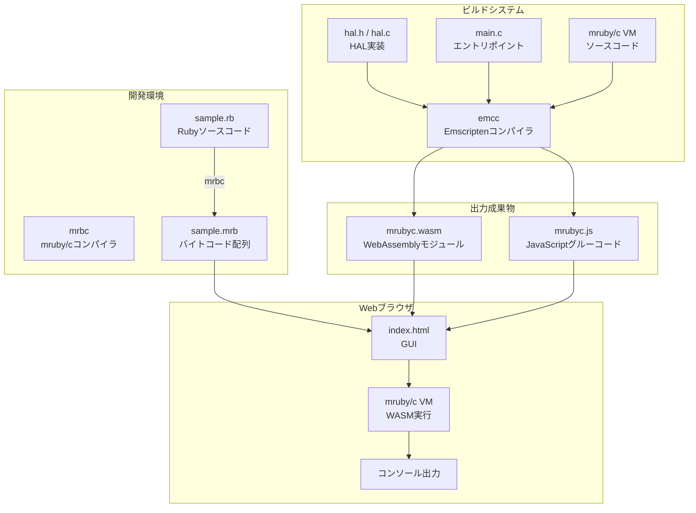
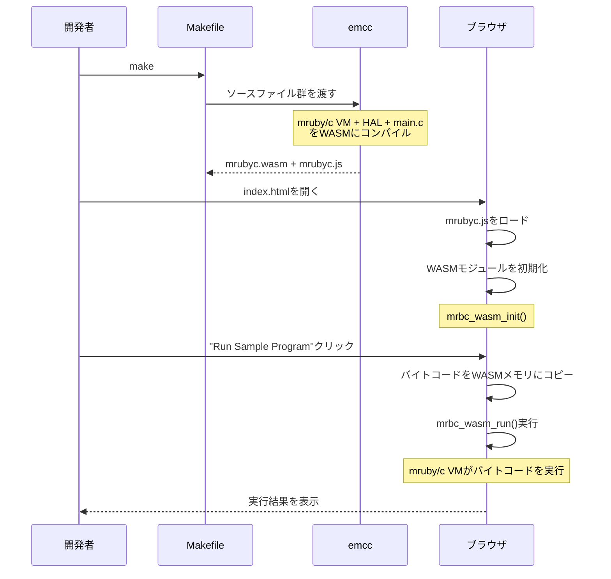
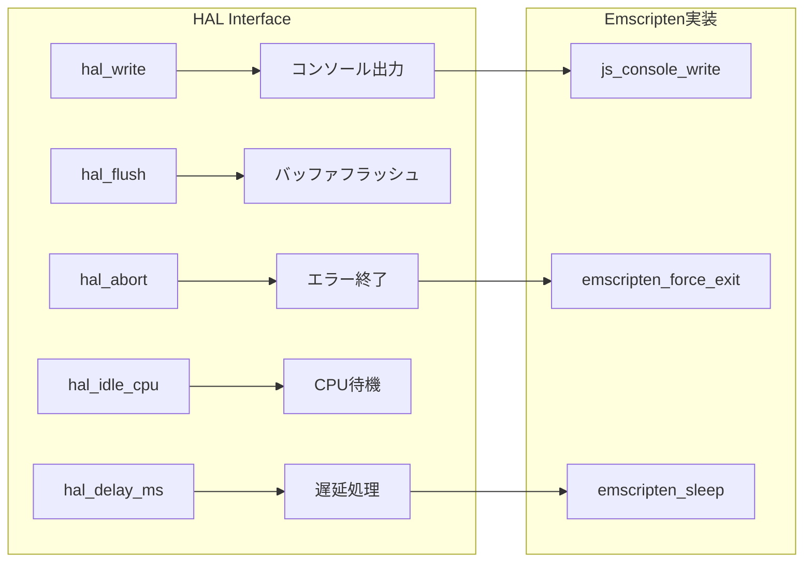
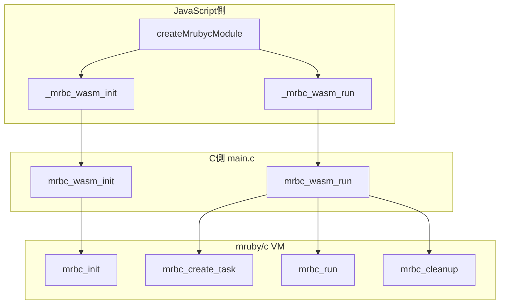
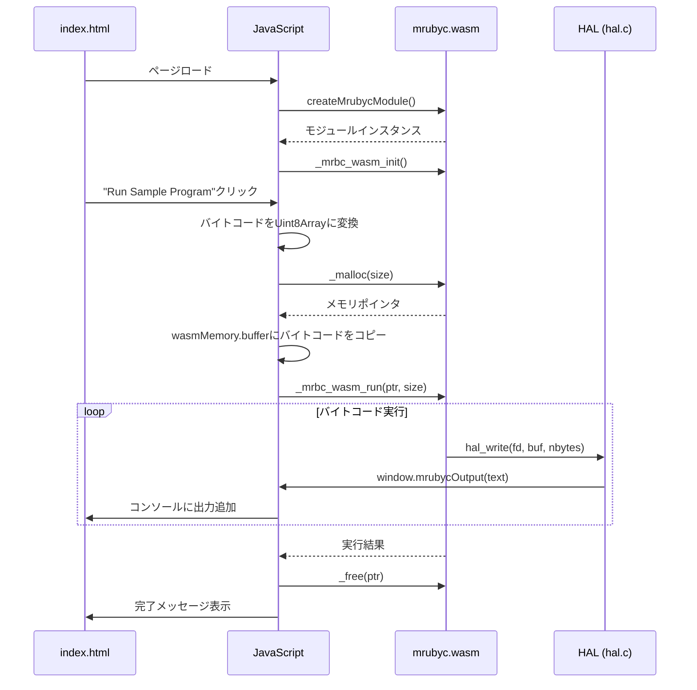
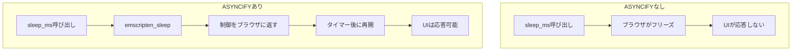

# study-WebSimulator

[](https://deepwiki.com/uist1idrju3i/study-WebSimulator)

mruby/cをEmscriptenでWebAssemblyにビルドし、Webブラウザ上で動作させるプロジェクトです。

## 概要

このプロジェクトは、組み込み向けRuby実装である[mruby/c](https://github.com/mrubyc/mrubyc)をWebAssembly(WASM)にコンパイルし、Webブラウザ上でmruby/cバイトコードを実行できる環境を提供します。

## アーキテクチャ

### 全体構成



### ビルドフロー



## ディレクトリ構成

```
study-WebSimulator/
├── Makefile                    # Emscriptenビルド設定
├── README.md                   # このファイル
├── emsdk/                      # Emscripten SDK (サブモジュール)
├── mrubyc/                     # mruby/c (サブモジュール)
├── public_html/                # Web公開ディレクトリ
│   ├── index.html              # HTMLマークアップ
│   ├── style.css               # スタイルシート
│   ├── app.js                  # アプリケーションロジック
│   ├── sample_bytecode.js      # サンプルバイトコード
│   └── mrubyc/                 # mruby/c WASM関連ファイル
│       ├── mrubyc.js           # Emscripten生成JSグルーコード
│       ├── mrubyc.wasm         # WebAssemblyモジュール
│       └── LICENSE             # mruby/cライセンス
└── src/
    ├── main.c                  # WASMエントリポイント
    ├── lib/
    │   └── mrubyc/
    │       ├── hal.h           # HALヘッダー
    │       └── hal.c           # HAL実装
    └── rb/
        ├── sample.rb           # サンプルRubyコード
        └── sample.mrb          # コンパイル済みバイトコード
```

## 作成・変更したファイルの解説

### 1. Makefile

Emscriptenを使用してmruby/cをWebAssemblyにビルドするための設定ファイルです。

**主要な設定:**

| 設定項目 | 値 | 説明 |
|---------|-----|------|
| `CFLAGS` | `-O3 -flto -DNDEBUG` | 最適化レベル3、デバッグ無効 |
| `WASM=1` | - | WebAssembly出力を有効化 |
| `ASYNCIFY` | - | 非同期処理（sleep等）のサポート |
| `ASYNCIFY_STACK_SIZE` | `16384` | ASYNCIFY用スタックサイズ（デフォルト4096から増加） |
| `ASYNCIFY_ADD` | `["mrbc_*","hal_*","main"]` | ASYNCIFY対象関数のパターン |
| `MODULARIZE=1` | - | ESモジュール形式で出力 |
| `ALLOW_MEMORY_GROWTH=1` | - | 動的メモリ拡張を許可 |

**エクスポートされる関数:**
- `_mrbc_wasm_init`: VM初期化
- `_mrbc_wasm_run`: バイトコード実行
- `_malloc` / `_free`: メモリ管理

### 2. src/lib/mrubyc/hal.h (HALヘッダー)

Hardware Abstraction Layer（ハードウェア抽象化レイヤー）のヘッダーファイルです。mruby/cがハードウェアに依存する部分を抽象化し、異なるプラットフォームで動作できるようにします。

**変更理由:**
- 元のファイルは`delay()`関数を使用していましたが、Emscripten環境では`emscripten_sleep()`を使用する必要があります
- `MRBC_NO_TIMER`を定義してタイマー割り込みを無効化（ブラウザ環境では不要）
- `MRBC_SCHEDULER_EXIT`を定義してスケジューラ終了を有効化



### 3. src/lib/mrubyc/hal.c (HAL実装)

HALの具体的な実装ファイルです。Emscripten環境向けに以下の機能を実装しています。

**実装内容:**

| 関数 | 説明 | 実装方法 |
|------|------|----------|
| `hal_write()` | 標準出力への書き込み | `EM_JS`マクロでJavaScript関数を呼び出し |
| `hal_flush()` | バッファのフラッシュ | 何もしない（即時出力のため） |
| `hal_abort()` | 異常終了 | エラーメッセージ表示後、`emscripten_force_exit(1)` |
| `hal_delay_ms()` | ミリ秒単位の遅延 | `emscripten_sleep()`を使用 |

**EM_JSマクロについて:**
Emscriptenの`EM_JS`マクロを使用することで、C言語からJavaScript関数を直接呼び出すことができます。これにより、ブラウザのコンソールAPIやDOM操作が可能になります。

```c
EM_JS(void, js_console_write, (const char *buf, int nbytes), {
  const text = UTF8ToString(buf, nbytes);
  if (typeof window !== 'undefined' && window.mrubycOutput) {
    window.mrubycOutput(text);  // カスタム出力関数
  } else {
    console.log(text);          // フォールバック
  }
});
```

### 4. src/main.c (エントリポイント)

WebAssemblyモジュールのエントリポイントです。JavaScriptから呼び出される関数を定義しています。

**エクスポート関数:**



**メモリ管理:**
- 40KBの静的メモリプールを確保
- mruby/cのメモリアロケータがこのプール内でメモリを管理
- 実行後は`mrbc_cleanup()`でリソースを解放し、再初期化

### 5. public_html/index.html (HTMLマークアップ)

ブラウザ上でmruby/cを操作するためのユーザーインターフェースのHTMLマークアップです。スタイルとロジックは別ファイル（style.css, app.js）に分離されています。

**機能:**
1. **ステータス表示**: モジュールの読み込み状態とバージョン情報
2. **サンプル実行**: 組み込みのサンプルプログラムを実行
3. **カスタムバイトコード**: `.mrb`ファイルをアップロードして実行
4. **出力コンソール**: 実行結果をリアルタイム表示

### 6. public_html/style.css (スタイルシート)

GUIのスタイル定義を含むCSSファイルです。レスポンシブデザインに対応し、ダークテーマのコンソール表示を実装しています。

### 7. public_html/app.js (アプリケーションロジック)

WASMモジュールの初期化、バイトコード実行、ファイルアップロード処理などのアプリケーションロジックを含むJavaScriptファイルです。

**主要な機能:**
- WASMモジュールの非同期初期化
- バイトコードのメモリコピーと実行（`ccall`の`async: true`オプションでASYNCIFYに対応）
- ファイルサイズ検証（1MB制限）
- エラーハンドリングとメモリ解放

**JavaScript-WASM連携:**



### 8. public_html/sample_bytecode.js

`src/rb/sample.mrb`のバイトコードをJavaScript配列として定義したファイルです。

**元のRubyコード (sample.rb):**
```ruby
printf "#{RUBY_ENGINE} #{MRUBYC_VERSION} (mruby:#{MRUBY_VERSION} ruby:#{RUBY_VERSION})\n"
puts "Hello, mruby/c!"
sleep_ms 1000
puts "Goodbye!"
```

## ビルド方法

### 前提条件

- Git（サブモジュール取得用）
- Python 3（Emscripten SDK用）

### 手順

1. **リポジトリのクローン**
   ```bash
   git clone --recursive https://github.com/uist1idrju3i/study-WebSimulator.git
   cd study-WebSimulator
   ```

2. **Emscripten SDKのセットアップ**
   ```bash
   cd emsdk
   ./emsdk install latest
   ./emsdk activate latest
   source ./emsdk_env.sh
   cd ..
   ```

3. **ビルド**
   ```bash
   make
   ```

4. **ローカルサーバーで実行**
   ```bash
   cd public_html
   python3 -m http.server 8080
   ```

5. **ブラウザでアクセス**
   ```
   http://localhost:8080/
   ```

## 技術的な詳細

### ASYNCIFYについて

Emscriptenの`ASYNCIFY`機能は、同期的なC関数を非同期的に実行できるようにします。これにより、`sleep_ms()`のような待機関数がブラウザのイベントループをブロックせずに動作します。



### メモリ管理

WebAssemblyのメモリは線形メモリとして管理されます。JavaScriptからWASMメモリにアクセスするには、`wasmMemory.buffer`を使用します。

```javascript
const bytecodePtr = mrubycModule._malloc(bytecode.length);
const heapU8 = new Uint8Array(mrubycModule.wasmMemory.buffer);
heapU8.set(bytecode, bytecodePtr);
```

## ボード設定の作成方法

このプロジェクトでは、Cコードを再コンパイルすることなく、JavaScript側だけで新しいマイコンボードのサポートを追加できます。

### ディレクトリ構造

新しいボードを追加するには、`public_html/boards/` ディレクトリ内に以下の構造でファイルを作成します：

```
public_html/boards/
└── your-board-id/
    ├── board-config.js      # ボード固有の設定
    ├── ui-components.js     # UI生成コード
    └── api-definitions.js   # mruby/c APIの定義
```

### 必要なファイル

#### 1. board-config.js

ボードの基本設定を定義します：

```javascript
const BOARD_CONFIG = {
  name: "Your Board Name",
  id: "your-board-id",
  description: "Description of your board",
  
  ui: {
    matrixWidth: 10,    // LEDマトリックスの幅
    matrixHeight: 6,    // LEDマトリックスの高さ
    totalPixels: 60     // 総LED数
  }
};

if (typeof window !== 'undefined') {
  window.BOARD_CONFIG = BOARD_CONFIG;
}
```

#### 2. api-definitions.js

mruby/c用のクラスとメソッドを定義します。`MrubycWasmAPI`クラスを使用してWASM APIにアクセスします：

```javascript
let registeredCallbacks = [];

class MrubycWasmAPI {
  constructor(module) {
    this.module = module;
  }

  // クラス定義
  getClassObject() {
    return this.module._mrbc_wasm_get_class_object();
  }

  defineClass(name, superClass) {
    return this.module.ccall(
      'mrbc_wasm_define_class', 'number',
      ['string', 'number'], [name, superClass]
    );
  }

  defineMethod(cls, name, func) {
    this.module.ccall(
      'mrbc_wasm_define_method', null,
      ['number', 'string', 'number'], [cls, name, func]
    );
  }

  // 引数取得メソッド
  getIntArg(vPtr, index) {
    return this.module._mrbc_wasm_get_int_arg(vPtr, index);
  }

  getFloatArg(vPtr, index) {
    return this.module._mrbc_wasm_get_float_arg(vPtr, index);
  }

  isNumericArg(vPtr, index) {
    return this.module._mrbc_wasm_is_numeric_arg(vPtr, index) !== 0;
  }

  // 戻り値設定メソッド
  setReturnBool(vPtr, val) {
    this.module._mrbc_wasm_set_return_bool(vPtr, val ? 1 : 0);
  }

  setReturnNil(vPtr) {
    this.module._mrbc_wasm_set_return_nil(vPtr);
  }

  setReturnInt(vPtr, val) {
    this.module._mrbc_wasm_set_return_int(vPtr, val);
  }

  setReturnFloat(vPtr, val) {
    this.module._mrbc_wasm_set_return_float(vPtr, val);
  }

  // コールバック関数の登録
  addFunction(func, signature) {
    return this.module.addFunction(func, signature);
  }

  removeFunction(funcPtr) {
    this.module.removeFunction(funcPtr);
  }
}

function defineYourAPI(mrubycModule) {
  const api = new MrubycWasmAPI(mrubycModule);
  const classObject = api.getClassObject();
  
  // クラスの定義
  const yourClass = api.defineClass('YOUR_CLASS', classObject);
  
  // メソッドの定義
  // シグネチャ: void func(mrb_vm *vm, mrb_value *v, int argc)
  const methodCallback = api.addFunction((vmPtr, vPtr, argc) => {
    // 引数の取得
    if (api.isNumericArg(vPtr, 1)) {
      const arg1 = api.getIntArg(vPtr, 1);
      // 処理...
      api.setReturnBool(vPtr, true);
    } else {
      api.setReturnBool(vPtr, false);
    }
  }, 'viii');
  
  registeredCallbacks.push(methodCallback);
  api.defineMethod(yourClass, 'method_name', methodCallback);
}

function cleanupYourAPI(mrubycModule) {
  const api = new MrubycWasmAPI(mrubycModule);
  for (const callback of registeredCallbacks) {
    try {
      api.removeFunction(callback);
    } catch (e) {
      console.warn('Failed to remove callback:', e);
    }
  }
  registeredCallbacks = [];
}

if (typeof window !== 'undefined') {
  window.defineYourAPI = defineYourAPI;
  window.cleanupYourAPI = cleanupYourAPI;
}
```

#### 3. ui-components.js

ボード固有のUI要素を生成します：

```javascript
function createBoardUI(container, config) {
  container.innerHTML = '';
  
  const title = document.createElement('div');
  title.textContent = `${config.ui.matrixWidth}x${config.ui.matrixHeight} RGB MATRIX for ${config.name}`;
  container.appendChild(title);
  
  const dotContainer = document.createElement('div');
  dotContainer.id = 'dot-container';
  container.appendChild(dotContainer);
  
  for (let i = 0; i < config.ui.totalPixels; i++) {
    const dot = document.createElement('div');
    dot.id = i;
    dot.className = 'dot';
    dot.textContent = i;
    dotContainer.appendChild(dot);
  }
}

function setPixelColor(id, red, green, blue) {
  const targetDot = document.getElementById(id);
  if (targetDot) {
    targetDot.style.backgroundColor = `rgb(${red}, ${green}, ${blue})`;
    const brightness = red + green + blue;
    targetDot.style.color = brightness > 128 * 3 ? '#666' : 'white';
  }
}

function cleanupBoardUI(container) {
  container.innerHTML = '';
}

if (typeof window !== 'undefined') {
  window.createBoardUI = createBoardUI;
  window.setPixelColor = setPixelColor;
  window.cleanupBoardUI = cleanupBoardUI;
}
```

### 新しいボードの登録

`public_html/lib/board-loader.js` の `availableBoards` 配列に新しいボードを追加します：

```javascript
this.availableBoards = [
  { id: 'xiao-nrf54l15', name: 'XIAO nRF54L15', path: 'boards/xiao-nrf54l15' },
  { id: 'your-board-id', name: 'Your Board Name', path: 'boards/your-board-id' }
];
```

または、実行時に動的に登録することもできます：

```javascript
boardLoader.registerBoard({
  id: 'your-board-id',
  name: 'Your Board Name',
  path: 'boards/your-board-id'
});
```

### WASM API リファレンス

| C関数 | JavaScript API | 説明 |
|-------|---------------|------|
| `mrbc_wasm_get_class_object()` | `api.getClassObject()` | Objectクラスのポインタを取得 |
| `mrbc_wasm_define_class()` | `api.defineClass(name, super)` | 新しいクラスを定義 |
| `mrbc_wasm_define_method()` | `api.defineMethod(cls, name, func)` | メソッドを定義 |
| `mrbc_wasm_get_int_arg()` | `api.getIntArg(vPtr, index)` | 整数引数を取得 |
| `mrbc_wasm_get_float_arg()` | `api.getFloatArg(vPtr, index)` | 浮動小数点引数を取得 |
| `mrbc_wasm_is_numeric_arg()` | `api.isNumericArg(vPtr, index)` | 引数が数値かチェック |
| `mrbc_wasm_set_return_bool()` | `api.setReturnBool(vPtr, val)` | 真偽値を返す |
| `mrbc_wasm_set_return_nil()` | `api.setReturnNil(vPtr)` | nilを返す |
| `mrbc_wasm_set_return_int()` | `api.setReturnInt(vPtr, val)` | 整数を返す |
| `mrbc_wasm_set_return_float()` | `api.setReturnFloat(vPtr, val)` | 浮動小数点数を返す |

### デバッグ方法

1. ブラウザの開発者ツールを開く（F12）
2. コンソールタブでエラーメッセージを確認
3. `console.log()` を使用してデバッグ情報を出力
4. ネットワークタブでスクリプトの読み込みを確認

### 注意事項

1. **メモリ管理**: `addFunction()` で作成したコールバック関数は、ボード切り替え時に `removeFunction()` で適切に解放してください。

2. **エラーハンドリング**: JavaScript-WASM間の呼び出しは型安全ではないため、適切なバリデーションとエラーハンドリングを実装してください。

3. **コールバック署名**: mruby/cメソッドのコールバック関数は `'viii'` シグネチャ（void, int, int, int）を使用します。

## ライセンス

このプロジェクトはBSD 3-Clause Licenseの下で配布されています。

mruby/cは以下の著作権者によるものです：
- Copyright (C) 2015- Kyushu Institute of Technology.
- Copyright (C) 2015- Shimane IT Open-Innovation Center.

## 参考リンク

- [mruby/c](https://github.com/mrubyc/mrubyc) - 組み込み向けRuby実装
- [Emscripten](https://emscripten.org/) - C/C++からWebAssemblyへのコンパイラ
- [WebAssembly](https://webassembly.org/) - ブラウザで動作するバイナリ形式
